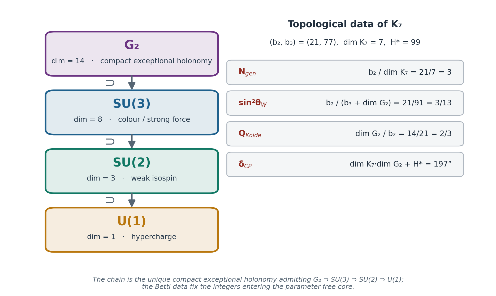

# Geometric Information Field Theory

[](https://pypi.org/project/giftpy/)
[](https://github.com/gift-framework/core/actions/workflows/verify.yml)
[](https://github.com/gift-framework/core/blob/main/LICENSE)

**What if physics isn't fine-tuned, just well-shaped?**

GIFT explores whether the dimensionless parameters of the Standard Model may be
topological invariants of a single compact 7-manifold: an E₈×E₈ gauge theory on a
G₂-holonomy manifold K₇ with Betti numbers (b₂, b₃) = (21, 77). No fitting, no free
parameters — each prediction is a consequence of shape, and each is individually
correct-or-wrong.



*The compact exceptional holonomy chain G₂ ⊃ SU(3) ⊃ SU(2) ⊃ U(1) and the Betti
data of K₇ that fix the integers entering the parameter-free core.*

---

## At a Glance

- **Zero free parameters** — Standard Model dimensionless parameters expressed as
  topological invariants of K₇, (b₂, b₃) = (21, 77).
- **Machine-checked** — 15 Lean-4 axioms (4 on the prediction chain + 11
  interval-arithmetic certificates for the K3 block), **0 `sorry`**, 460+ certified
  relations.
- **33 exact relations** among topological integers — the parameter-free core; each
  individually falsifiable, none tunable.
- **Falsifiable** — δ_CP = 197°, N_gen = 3, θ₂₃ upper octant; decided by DUNE / FCC-ee.
- **Non-generic** — among 3,000,000 random algebraic formula *sets* drawn from the
  framework's own vocabulary, none reproduces its joint profile (set-level upper
  bound ≈ 10⁻⁶, no independence assumption).
- *Precision (secondary):* 0.92% mean deviation on the 33 Type-I relations; 95
  observables total, 66 with experimental data.
  *(NuFIT 6.1 / PDG 2024 / Planck 2018 / CODATA 2022 · core v3.4.26)*

---

> **Cited in the peer-reviewed literature.** Heyes, Hirst, Sá Earp & Silva,
> *Phys. Lett. B* **878** (2026) 140566 (Imperial College London / UNICAMP)
>
> Invited remote participant, "DANGER: Data, Numbers, and Geometry" workshop
> *Banff International Research Station (BIRS)*, April 5–10, 2026. 

---

## Proven · Computed · Conjectured · Falsifies

| ✅ Proven (Lean 4) | 🔢 Computed (numeric) | 🔭 Conjectured | ⚖️ Falsifies |
|---|---|---|---|
| 33 exact relations among topological integers | Closed-form K3 metric witness, order-3 ansatz | E₈×E₈ → K₇ compactification realizes the SM | δ_CP = 197° → DUNE (2028–2040) |
| K3 interval certificates (Krawczyk containment, variance envelope ≤ 1321/10⁷) | 95-observable table, 0.92% mean deviation (Type I) | Full smooth compact G₂ analytic construction of (21, 77) — **open** | θ₂₃ in the upper octant → DUNE / NuFIT |
| G₂ lattice & isotype certificates · **0 `sorry`** | Volume-form residual certified interval-rigorous on a frozen box-local witness | Physical reading of the topological coupling κ_T | N_gen = 3 |

---

## Start Here

| | |
|---|---|
| 🌍 **Curious?** | [**→ GIFT**](https://github.com/gift-framework/GIFT) — the framework, plain-language guides, documentation, statistical validation |
| 📐 **Want the proofs?** | [**→ core**](https://github.com/gift-framework/core) — the Lean 4 formalization and `giftpy` |

```bash
pip install giftpy
```

```python
from gift_core import *

print(SIN2_THETA_W)   # Fraction(3, 13)
print(GAMMA_GIFT)     # Fraction(511, 884)
print(TAU)            # Fraction(3472, 891)
```

---

## Follow

| | |
|---|---|
| [giftheory.substack.com](https://giftheory.substack.com) | Essays on topology, physics, and the research process |
| [@giftheory](https://youtube.com/@giftheory) | Video introductions to the framework |
| [@GIFTheory](https://x.com/GIFTheory) | Automated facts from the framework, twice a week |

---

## Published Papers

- **GIFT v3.4** — Standard Model Parameters as Topological Invariants of a G₂ Holonomy Manifold
  DOI: [10.5281/zenodo.20070101](https://doi.org/10.5281/zenodo.20070101)
- **Paper A** — A Certified Torsion-Free G₂ Structure on a TCS Neck Model
  DOI: [10.5281/zenodo.19892350](https://doi.org/10.5281/zenodo.19892350)
- **Paper B** — Spectral Geometry of an Explicit G₂ Metric: Laplacian Spectrum and Harmonic Forms
  DOI: [10.5281/zenodo.19893371](https://doi.org/10.5281/zenodo.19893371)
- **Paper C** — Newton–Kantorovich Diagnostics on a Donaldson K3 Metric
  DOI: [10.5281/zenodo.19708916](https://doi.org/10.5281/zenodo.19708916)
- **Paper D** — Donaldson Analytic Note: explicit closed-form G₂ ansatz with Wirtinger certificate
  DOI: [10.5281/zenodo.20039066](https://doi.org/10.5281/zenodo.20039066)

## Cited By

- Heyes, Hirst, Sá Earp & Silva — *Neural and numerical methods for G₂-structures on contact Calabi–Yau 7-manifolds*, **Phys. Lett. B 878 (2026) 140566** (Imperial College London / UNICAMP)
- Zhou & Zhou — *Algebraic Stability and Cosmological Structure* (2026): derive (b₂, b₃) = (21, 77) from self-referential dynamics, citing GIFT as empirical motivation
- Mamun — *The Void Paradox: Towards a Universal Coordinate System for Information Reality* (2026), University of Oxford
- Cabannas & Silva — *The Modal Discipline of Objectivity* (2026), UFBA / UFMA

## Resources

- [Blueprint](https://gift-framework.github.io/core/) — Lean formalization dependency graph
- [giftpy on PyPI](https://pypi.org/project/giftpy/) — `pip install giftpy`
- [Zenodo](https://doi.org/10.5281/zenodo.20070101) — canonical publications (framework v3.4)

---

If this resonates, **star the repos** so others find it. Try it in ten seconds with
`pip install giftpy`, and follow the story on [Substack](https://giftheory.substack.com).

---
> GIFT FROM BIT
---
